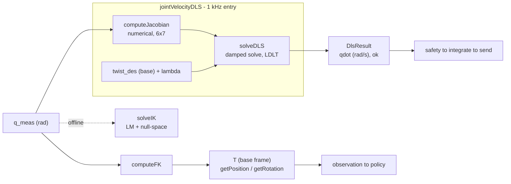

# kinova_kinematics

From-scratch kinematics for the **Kinova Gen3 7-DOF** arm: forward kinematics, a geometric
Jacobian, damped-least-squares differential IK for 1 kHz velocity control, and a full
Levenberg–Marquardt pose solver — implemented directly on Eigen, with **no vendor SDK
dependency**, so it builds and is tested entirely off-robot.

This is the kinematics layer of a research project on **force-conditioned skill portability**
(a frozen policy driving a robot-specific analytic adapter). The math here — FK, Jacobian,
DLS — is written from first principles rather than pulled from a library, and the differential
solver is characterised for real-time use. See [`design.md`](design.md) for the full derivations
and design rationale.

---

## Highlights

- **Analytic FK** from a classical Denavit–Hartenberg chain (8 frames, radians throughout).
- **Geometric Jacobian**, 6×7, by finite difference — fixed-size, no heap allocation.
- **Damped least-squares differential IK** (`jointVelocityDLS`) sized for a 1 ms control cycle,
  with a derived worst-case velocity bound and a guarded, testable linear-algebra core.
- **Levenberg–Marquardt pose IK** (`solveIK`) with null-space joint-centering, for offline use.
- **No Kortex/robot dependency** — depends only on Eigen3, so `colcon build` and the unit tests
  run on any machine (CI-friendly).
- **Latency-benchmarked** under real-time scheduling: mean **1.90 µs**, p99.9 **3.04 µs** per
  IK call against a 1000 µs budget.

---

## Pipeline position

Two independent paths run through this library — an **observation** path (measured, flows up to
the policy) and an **action** path (commanded, flows down to the arm). They share no code.



`computeFK` feeds the observation side; `jointVelocityDLS` feeds the action side, with the
Jacobian evaluated at the **measured** configuration. `solveIK` is offline only — it solves for
a *pose*, whereas the loop needs a single-shot *velocity* solve.

---

## Public API

| Function | Input | Output | Units / frame |
|---|---|---|---|
| `computeFK(q)` | `array<double,7>` joint angles | `Matrix4d` EE pose | q [rad] → pose [m], **base** (incl. 0.113 m tool z-offset) |
| `getPosition(T)` | `Matrix4d` | `Vector3d` | [m], base |
| `getRotation(T)` | `Matrix4d` | `Matrix3d` | base (first two columns = 6D orientation observation) |
| `computeJacobian(q)` | `array<double,7>` [rad] | `Matrix<double,6,7>` | geometric, base; rows 0–2 [m/rad], rows 3–5 [dimensionless] |
| `solveDLS(J, twist, λ)` | `J` 6×7, `twist` 6×1 [base], `λ` | `DlsResult` | twist rows 0–2 [m/s], 3–5 [rad/s]; **public test seam** |
| `jointVelocityDLS(q, twist, λ)` | `q` [rad], `twist` [base], `λ` | `DlsResult` | 1 kHz entry point; builds `J` internally |
| `solveIK(pose, guess, iters, pos_tol, ori_tol)` | target `Matrix4d`, guess [rad] | `IKResult` | **offline**; LM + null-space |

**`DlsResult`** carries `qdot` [rad/s, 7×1], `twist_achieved` = `J·qdot`, `lambda_used`,
`manipulability` (deliberately `NaN` — see below), and `ok`. When `ok == false`, `qdot` is
zeroed and must not be commanded.

---

## The differential solve, in one paragraph

`J` is 6×7, so `J·q̇ = v` is **underdetermined** — the right choice is the minimum-norm damped
solution `q̇ = Jᵀ(J·Jᵀ + λ²I)⁻¹v`, evaluated as a 6×6 **LDLᵀ** linear solve (never an explicit
inverse). Damping replaces the singular-direction gain `1/σ` with `σ/(σ²+λ²)`, which → 0 rather
than → ∞ near a singularity, giving the derived worst-case bound **‖q̇‖ ≤ ‖v‖/(2λ)**. That bound
is what makes the downstream safety clamp defensible rather than arbitrary. λ is a per-call
parameter, guarded (`>0`, finite) inside `solveDLS`. Full derivation in [`design.md`](design.md) §5–6.

---

## Denavit–Hartenberg parameters (classical, radians)

| Frame | α | a | d (m) | θ offset |
|---|---|---|---|---|
| 0 (base) | π | 0 | 0 | 0 |
| 1 | π/2 | 0 | −0.2848 | 0 |
| 2 | π/2 | 0 | −0.0118 | π |
| 3 | π/2 | 0 | −0.4208 | π |
| 4 | π/2 | 0 | −0.0128 | π |
| 5 | π/2 | 0 | −0.3143 | π |
| 6 | π/2 | 0 | 0 | π |
| 7 | π | 0 | −0.1674 | π |
| tool | — | — | +0.113 (z) | — |

FK gives z = 1.1873 m at the home configuration; symmetry checks pass. Hardware FK-vs-Kortex
comparison is pending (see Limitations).

---

## Latency

`jointVelocityDLS` (Jacobian build + damped solve), measured by `tests/benchmark_dls.cpp`,
N = 1,000,000, `RelWithDebInfo`, real-time scheduling `chrt -f 80` + `taskset -c 2` on a P-core:

| mean | p50 | p99 | p99.9 | max (1 in 10⁶) | budget |
|---|---|---|---|---|---|
| 1.90 µs | 1.86 µs | 2.35 µs | **3.04 µs** | 94.4 µs | 1000 µs |

~0.2 % of the cycle typically, ~0.3 % at the 1-in-1000 tail. The tight p99.9-vs-mean gap
indicates no heap allocation on the hot path (fixed-size Eigen throughout).

---

## Build & test

Depends only on `ament_cmake` and `Eigen3` — no robot, no Kortex SDK.

```bash
# from the workspace root
colcon build --packages-select kinova_kinematics --cmake-args -DCMAKE_BUILD_TYPE=RelWithDebInfo

# unit tests (GoogleTest)
colcon test --packages-select kinova_kinematics
colcon test-result --verbose

# latency benchmark (real-time + pinned)
chrt -f 80 taskset -c 2 ./build/kinova_kinematics/benchmark_dls dls_latency.csv
```

Tests cover round-trip accuracy, minimum-norm (with a duplicate-column Jacobian so the claim is
falsifiable), zero-twist, linearity, boundedness near a singularity against the derived bound,
λ-monotonicity, and rejection of NaN / non-finite / non-positive λ.

---

## Repository layout

```
kinova_kinematics/
├── include/kinova_kinematics/
│   └── KinovaKinematics.hpp     # public API, DlsResult / IKResult
├── src/
│   └── KinovaKinematics.cpp     # FK, Jacobian, solveDLS, jointVelocityDLS, solveIK
├── tests/
│   ├── test_fk.cpp              # forward-kinematics checks
│   ├── test_dls.cpp             # differential-IK unit tests (GoogleTest)
│   └── benchmark_dls.cpp        # latency benchmark → CSV
├── CMakeLists.txt
├── package.xml
├── design.md                   # derivations, units/frames, failure modes, rationale
└── README.md
```

---

## Limitations (honest scope)

- **Numerical, not analytic, Jacobian.** Finite difference (8 DH evaluations per call). Fast
  enough for the 1 kHz budget as measured; an analytic Jacobian is the fallback only if a future
  timing problem appears.
- **Single scalar λ is dimensionally inconsistent** across the linear (m/rad) and angular
  (dimensionless) Jacobian rows. Documented, not fixed in v1; a weighted-Jacobian remedy is
  deferred (`design.md` §5.4).
- **Manipulability is not computed here** — `DlsResult::manipulability` is `NaN` by design, so a
  `0.0` can never be mistaken for "exactly singular." The consuming monitor computes its own
  metric.
- **Hardware FK verification pending.** FK is checked analytically at the home configuration; the
  FK-vs-Kortex comparison on the arm has not yet been recorded.
- **Tool offset is currently a literal** (0.113 m) in `computeFK`; exposing it as a configuration
  parameter is planned.
- **No joint velocity limits** in this library — position limits are hardcoded from the datasheet;
  velocity limits and clamping live in the downstream safety layer.

---

*Advanced Biomechatronics and Locomotion Lab, Carleton University.*
