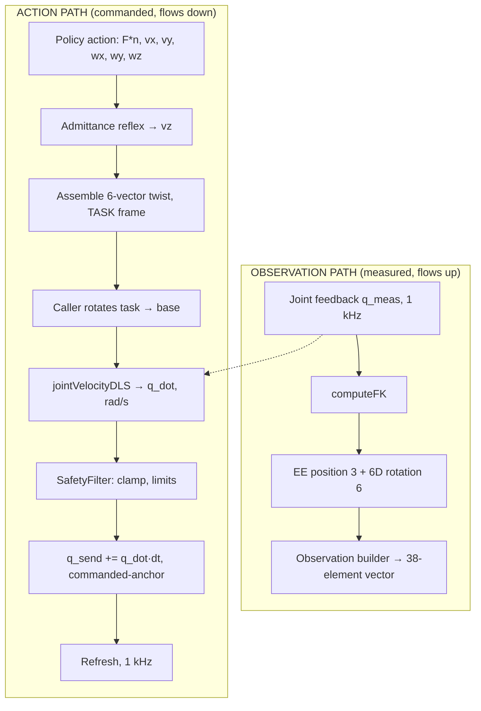

# kinova_kinematics — Design Document

**Scope.** Forward kinematics, the geometric Jacobian, the iterative pose solver, and the
differential inverse kinematics used inside the 1 kHz control loop (Phase 0, Step 6).

**Status.** FK, Jacobian and `solveIK` are implemented and verified on hardware.
`jointVelocityDLS` is specified here and not yet implemented.

**Convention.** Classical Denavit–Hartenberg, 8 frames (rows 0–7). Confirmed against
hardware: z = 1.1873 m at the home configuration, symmetry checks pass.

---

## 1. Where this library sits

The pipeline has two independent paths through this library. They must not share code.



`computeFK` serves the **observation** side. `jointVelocityDLS` serves the **action** side.
`computeJacobian` is called on the action side only, evaluated at the measured `q_meas`.

**`solveIK` is not used in the 1 kHz loop.** It is an iterative *pose* solver — it takes a
target pose and iterates to convergence. The loop needs a single-shot *velocity* solve at a
fixed 1 ms budget. In particular, the error-proportional damping heuristic inside `solveIK`
(`lambda = 0.5 * de.norm() + 1e-4`) is meaningful only when there is a pose error to be
proportional to. In a differential solve there is no pose error, so that heuristic must not
be carried over. `solveIK` remains for offline planning and test fixtures.

---

## 2. Existing components (implemented, verified)

| Function | Returns | Units | Notes |
|---|---|---|---|
| `computeFK(q)` | `Matrix4d` | m, base frame | Classical DH chain, 8 frames |
| `getPosition(T)` | `Vector3d` | m | Translation block |
| `getRotation(T)` | `Matrix3d` | — | Rotation block; first two columns are the 6D observation |
| `computeJacobian(q)` | `MatrixXd 6×7` | see §4 | Numerical, finite difference, step `eps` |
| `solveIK(...)` | `IKResult` | m, rad | Iterative, DLS + null-space joint-limit term. **Offline only.** |
| `jointLimitGradient(q)` | `VectorXd 7` | — | Secondary objective for `solveIK` |

The Jacobian is computed numerically by finite difference rather than analytically. This is
adequate for the 1 kHz budget (see §8) but it is a numerical approximation, and the choice of
`eps` trades truncation error against floating-point cancellation. It is a candidate for
replacement by an analytic Jacobian if 6.5 benchmarking shows a timing problem.

---

## 3. The differential problem

**Given** a desired end-effector twist `v` in the **base** frame, and the current measured
joint configuration `q_meas`, **find** joint velocities `q_dot` such that `J(q) · q_dot ≈ v`.

For the Gen3, `J` is **6×7**. Six equations, seven unknowns: the system is
**underdetermined**, not overdetermined. There is an infinite family of exact solutions and
the question is which one to pick, not how to best approximate an unreachable one.

This matters because it selects the formulation. The correct object is the **minimum-norm**
solution — the `q_dot` of smallest magnitude that achieves the twist:

```
q_dot = Jᵀ (J Jᵀ)⁻¹ v          (minimum-norm pseudoinverse, right inverse)
```

The least-squares form `(Jᵀ J)⁻¹ Jᵀ` is for the overdetermined case and is wrong here —
`Jᵀ J` is 7×7 and singular by construction for a 6×7 Jacobian.

---

## 4. Units and frames — stated before anything else

| Quantity | Symbol | Units | Frame |
|---|---|---|---|
| Input twist, linear rows 0–2 | `v_lin` | m/s | **base** |
| Input twist, angular rows 3–5 | `v_ang` | rad/s | **base** |
| Joint configuration | `q` | rad | joint space, order 1..7 |
| Output joint velocity | `q_dot` | **rad/s** | joint space, order 1..7 |
| Jacobian rows 0–2 | — | m/rad | — |
| Jacobian rows 3–5 | — | dimensionless | — |

**Two unit boundaries the caller owns, both of which are known bug sources:**

1. **Task frame → base frame.** The policy action and the admittance reflex work in the
   *task* frame (latched at CONTACT entry). `jointVelocityDLS` takes a **base-frame** twist.
   The rotation is the caller's responsibility, deliberately — see §7. Apply a
   **rotation only**, never the full 4×4 homogeneous transform: a twist is a vector pair,
   not a point, and applying the translation leaks a phantom offset.

2. **rad/s → deg/s.** This function returns **rad/s**. The 1 kHz loop integrates into
   `q_send`, which is in **degrees** (Kortex `feedback.actuators(i).position()` is degrees).
   The conversion must happen at the integration step:
   `q_send_deg += q_dot_rad_s * (180/π) * dt`. Omitting it produces motion that is
   57× too slow and looks exactly like a damping problem.

---

## 5. Why damping, and how λ is chosen

### 5.1 The failure the damping fixes

Write the pseudoinverse in terms of the singular values of `J`. Each singular direction is
scaled by `1/σ`. As the arm approaches a singularity some `σ → 0`, so `1/σ → ∞`, and a small
commanded twist in that direction demands an unbounded joint velocity. On hardware that is a
violent, uncommanded motion.

Damped least squares replaces the per-direction gain:

```
1/σ        →        σ / (σ² + λ²)
```

As `σ → 0` the damped gain also goes to **zero** rather than to infinity. The solve stops
trying to move in directions the arm cannot move in, instead of trying infinitely hard.

The damped minimum-norm solution is:

```
q_dot = Jᵀ (J Jᵀ + λ² I₆)⁻¹ v
```

### 5.2 The worst-case velocity bound

Let `g(σ) = σ / (σ² + λ²)`. Then

```
g'(σ) = (λ² − σ²) / (σ² + λ²)²
```

which is zero at `σ = λ`, giving the maximum

```
g_max = λ / (2λ²) = 1 / (2λ)
```

Therefore, for any commanded twist:

```
‖q_dot‖  ≤  ‖v‖ / (2λ)                                            (BOUND-1)
```

This is exact, derived, and is the number the SafetyFilter's clamp threshold is set from.
It is worst-case: it is attained only when the commanded twist aligns with a singular
direction whose singular value happens to equal λ.

### 5.3 Choosing λ — the tension, stated honestly

A single constant λ cannot satisfy both requirements at once:

| λ | Behaviour near singularity | Behaviour in normal operation |
|---|---|---|
| Large (e.g. 0.29) | Tight velocity bound, safe | Heavily damped. At a typical σ ≈ 0.3, roughly half the commanded velocity is lost |
| Small (e.g. 0.05) | BOUND-1 gives ‖q_dot‖ ≤ 10·‖v‖ — too loose to rely on | Accurate tracking |

This is a known property of constant-λ DLS, not a defect in this design. The literature
answer is variable damping (λ raised only as `σ_min` falls), which requires `σ_min` every
cycle — an SVD, which is not affordable inside a 1 ms budget alongside the Jacobian.

**Decision.** λ is held small and constant for tracking quality. The velocity bound is
enforced **downstream in the SafetyFilter**, not inside this function. BOUND-1 is what makes
the filter's clamp threshold defensible rather than arbitrary. `jointVelocityDLS` reports
`manipulability` so the caller can observe proximity to singularity and act on it.

**Provisional value: λ = 0.05.** This is a starting point, not a result. It is replaced by
the outcome of the 6.4 sweep (§9), which measures, at each λ:

- twist residual `‖J·q_dot − v‖` at a nominal, well-conditioned configuration
- peak `‖q_dot‖` at a deliberately near-singular configuration
- whether the measured peak respects BOUND-1

λ is stored as a member variable with a setter so the sweep can run without recompiling.

**λ must be strictly positive.** At λ = 0 the damping vanishes and `J Jᵀ` may be singular,
so the factorisation in §6 is no longer guaranteed. Guard on construction.

### 5.4 The mixed-units defect — stated, not hidden

`λ² I₆` adds the *same scalar* to all six diagonal entries of `J Jᵀ`. But `J Jᵀ` does not have
uniform units. With linear Jacobian rows in m/rad and angular rows dimensionless, the blocks
of `J Jᵀ` carry units of m²/rad², m/rad, and 1 respectively. A single scalar λ is therefore
**dimensionally inconsistent** across the linear and angular parts of the system.

The practical consequence: the *effective* damping applied to translation and to rotation
differs by roughly the square of a characteristic length. A λ tuned for good translational
behaviour is not the λ that is right for rotation.

**This is a real defect and it is not fixed in v1.** It is recorded here so that it is not
later mistaken for a tuning problem.

*Proposal, NOT in the locked scope, flagged as scope creep and deferred to 6.5:* pre-multiply
the twist and the Jacobian by a diagonal weight `W = diag(1/L, 1/L, 1/L, 1, 1, 1)` with `L` a
characteristic arm length (order 0.5 m). This makes both blocks dimensionless and λ
dimensionally consistent. It changes the meaning of λ, so it must not be introduced silently
mid-sweep. Decide after the λ sweep, not during it.

The same wart applies to the Yoshikawa manipulability measure in §8.

---

## 6. Numerical method

`q_dot = Jᵀ (J Jᵀ + λ² I₆)⁻¹ v` is **not** evaluated by forming an inverse. It is evaluated as
a linear solve:

```
Step 1:  A = J Jᵀ + λ² I₆                       (6×6, symmetric, positive definite for λ > 0)
Step 2:  solve  A x = v   for x                 (LDLᵀ factorisation, x is 6×1)
Step 3:  q_dot = Jᵀ x                           (7×6 · 6×1 → 7×1)
```

**Why the 6×6 form.** The algebraic identity `Jᵀ(J Jᵀ + λ²I₆)⁻¹ = (Jᵀ J + λ²I₇)⁻¹Jᵀ` means
either could be used, but the left form factorises a 6×6 matrix and the right a 7×7. The 6×6
is cheaper and is the natural form for the underdetermined case.

**Why LDLᵀ.** It is a square-root-free symmetric factorisation `A = L D Lᵀ`, solved by three
triangular passes (forward substitution, diagonal scaling, back substitution). It exploits
symmetry — roughly half the work of a general LU — and never forms an inverse. Forming
`A.inverse()` and multiplying is both slower and numerically worse: it computes more than is
needed and discards conditioning information.

Because λ > 0 makes `A` strictly positive definite, plain Cholesky (`LLT`) is also valid and
marginally faster. **LDLᵀ is chosen for robustness**, since it degrades gracefully if `A`
becomes near-semidefinite from an ill-conditioned Jacobian. Revisit at 6.5 if timing demands.

---

## 7. API specification

```cpp
/**
 * @brief Result of one differential inverse-kinematics solve.
 */
struct DlsResult {
    Eigen::VectorXd qdot;            ///< 7x1 joint velocities [rad/s], joint order 1..7
    Eigen::VectorXd twist_achieved;  ///< 6x1 J*qdot, BASE frame [m/s; rad/s].
                                     ///< Differs from the commanded twist by the damping
                                     ///< residual. The caller logs it; it is the direct
                                     ///< measure of how much the damping cost us.
    double lambda_used   = 0.0;      ///< Damping actually applied this cycle (mixed units, see §5.4)
    double manipulability = 0.0;     ///< Singularity proximity measure (see §8)
    bool   valid         = false;    ///< False => qdot is zeroed; caller MUST NOT command it
};

/**
 * @brief Single-shot damped least-squares differential IK for the 1 kHz loop.
 *
 * Solves J(q) * qdot = twist_base for the minimum-norm damped solution.
 *
 * @param joint_angles  Current MEASURED joint configuration [rad], order 1..7.
 *                      Use q_meas from feedback, not the commanded q_send: the Jacobian
 *                      must be evaluated where the arm actually is.
 * @param twist_base    Desired end-effector twist in the BASE frame.
 *                      Rows 0-2 linear [m/s], rows 3-5 angular [rad/s].
 *                      The caller performs any task-frame to base-frame rotation.
 * @return DlsResult. On failure, valid == false and qdot is zeroed.
 *
 * @note Returns rad/s. The caller converts to degrees before integrating into q_send.
 * @note Performs NO clamping, NO null-space projection, NO integration. See "Not this
 *       function's job" below.
 */
DlsResult jointVelocityDLS(const std::array<double,7>& joint_angles,
                           const Eigen::VectorXd& twist_base);

void   setDampingLambda(double lambda);   ///< lambda > 0 enforced
double getDampingLambda() const;
```

`lambda_` is a member variable, not a parameter, so the 1 kHz loop does not re-pass a constant
every cycle and the 6.4 sweep can retune between runs without recompiling.

### Not this function's job — and why

Each of these is excluded deliberately. Each belongs somewhere else in the stack.

| Excluded | Why | Where it lives |
|---|---|---|
| **Velocity clamping** | Clamping here would silently distort the twist direction and hide it from the safety layer. Safety must be enforced in one auditable place. | **SafetyFilter**, downstream |
| **Null-space projection** | The 7-DOF redundancy is real and worth using, but a secondary objective changes `q_dot` for reasons unrelated to the commanded twist. Introducing it before the primary solve is characterised makes the λ sweep uninterpretable. | Deferred. Post-Phase-0 decision. |
| **Task → base rotation** | The task frame is latched at CONTACT entry and owned by the contact state machine. Rotating inside the IK would give this library a dependency on task state it has no business holding. | Caller (1 kHz loop) |
| **Integration to position** | `q_send` is the loop's integrator state under the commanded-anchor scheme. A kinematics library must be stateless with respect to the control loop. | 1 kHz loop |
| **Joint-limit checking** | Same argument as clamping: one auditable safety layer. | SafetyFilter |

---

## 8. Manipulability — DEFERRED to 6.5

`manipulability` reports proximity to singularity so the caller can react (slow down, refuse
to move, log). The metric is **not yet chosen**. Candidates:

| Candidate | Cost | Sensitivity near singularity | Note |
|---|---|---|---|
| Yoshikawa `w = sqrt(det(J Jᵀ))` | One 6×6 determinant | Goes to zero, but as a *product* of all σ — one small σ can be masked by large others | Carries the §5.4 mixed-units defect |
| `σ_min` from SVD | Full 6×7 SVD | Direct and unambiguous | Likely unaffordable at 1 kHz — measure before rejecting |
| `det(J Jᵀ + λ²I)` as proxy | Free — already factorised in §6 | Biased by λ, floors out rather than reaching zero | Cheapest; least meaningful |
| Condition number `σ_max/σ_min` | Full SVD | Direct | Same cost objection |

**Decision criterion, to be applied at 6.5:** measure the wall-clock cost of each against the
remaining budget (§9), then pick the most sensitive metric that fits. Do not pick on
principle before the timing is measured.

*Note:* the Week 16 visual-servoing work already plans to monitor `sqrt(det(J Jᵀ))`. If
Yoshikawa is selected here, that is one metric across the project rather than two.

---

## 9. Timing budget

The cycle is 1000 µs. Measured on hardware, the `Refresh()` UDP round-trip consumes
approximately 350 µs mean. That leaves roughly 650 µs, from which the IK, the admittance
reflex, the safety filter and the observation build must all be paid.

Per call, this function costs: one numerical Jacobian (7 FK evaluations at finite-difference
offsets, plus the base FK), one 6×7 · 7×6 product, one 6×6 LDLᵀ factorisation and solve, one
7×6 matrix–vector product, plus the manipulability metric.

The dominant term is almost certainly the **numerical Jacobian**, not the linear algebra — a
6×6 factorisation is trivial, while the Jacobian requires eight full DH chain evaluations.
This is an expectation to be measured at 6.5, not a claim.

**6.5 must report:** mean and max solve time over ≥ 10 000 calls, split between Jacobian and
solve. If the Jacobian dominates and the budget is tight, the fix is an analytic Jacobian, not
a cheaper solver.

---

## 10. Failure modes

| Mode | Detection | Behaviour |
|---|---|---|
| `twist_base` contains NaN/Inf | `allFinite()` on entry | `valid = false`, `qdot` zeroed |
| `twist_base` wrong size (≠ 6) | Size check on entry | `valid = false`, `qdot` zeroed |
| λ ≤ 0 | Enforced in `setDampingLambda` and constructor | Rejected at set time, never reaches the solve |
| LDLᵀ reports failure | Eigen `info() != Success` | `valid = false`, `qdot` zeroed |
| Near-singular configuration | `manipulability` drops | **Not a failure.** Damping handles it; `valid` stays true. The caller decides. |
| `joint_angles` outside limits | Not checked here | Caller / SafetyFilter responsibility (§7) |

**`valid == false` means `qdot` must not be commanded.** The 1 kHz loop's correct response is
to hold `q_send` at its previous value — *not* to skip the `Refresh()` call, which would trip
the firmware watchdog. Holding position is the safe degenerate command.

---

## 11. Testing strategy (off-robot, 6.3–6.4)

All tests run against the mock build (`USE_KORTEX_MOCK=ON`, the default) and require no arm.

**Correctness**
1. **Round trip.** Pick a well-conditioned `q`, choose an arbitrary `q_dot_true`, compute
   `v = J·q_dot_true`, solve. With small λ, `‖J·q_dot − v‖` must be small. Assert
   `EXPECT_NEAR` against a stated tolerance, not exact equality — damping guarantees a residual.
2. **Minimum norm.** For the same `v`, the returned `‖q_dot‖` must not exceed `‖q_dot_true‖`
   by more than the damping residual. This is what distinguishes minimum-norm from any other
   solution of an underdetermined system.
3. **Zero twist.** `v = 0` must give `q_dot = 0` exactly.
4. **Linearity.** `solve(2v) == 2·solve(v)`, within tolerance. The map is linear in `v`.

**Damping behaviour**
5. **Bounded near singularity.** Drive the arm to a near-singular configuration (an
   outstretched elbow is the easy one). Command a twist along the degenerate direction.
   `‖q_dot‖` must stay finite and must respect BOUND-1.
6. **λ monotonicity.** Sweep λ upward at a fixed configuration: the twist residual must
   increase monotonically and `‖q_dot‖` must decrease monotonically. If it does not, the
   implementation is wrong.
7. **λ sweep (6.4 deliverable).** Table of λ against residual (nominal config) and peak
   `‖q_dot‖` (near-singular config). This table selects the production λ and goes in the repo.

**Robustness**
8. NaN twist, wrong-size twist, λ set to 0 or negative — all handled per §10.

**Determinism.** No randomness. If randomised configurations are used, the seed is fixed and
logged.

---

## 12. Open items

| Item | Status | Blocks |
|---|---|---|
| Production λ | Provisional 0.05; set by the 6.4 sweep | Hardware integration (6.6+) |
| 2-DOF hand calculation | **Deferred one week.** Reclassified from gate to *verification* of BOUND-1 | Nothing |
| Manipulability metric | Deferred to 6.5 on measured timing | 6.5 |
| Mixed-units λ (§5.4) | Documented, not fixed. Weighted-Jacobian proposal deferred | Nothing in v1 |
| Analytic vs numerical Jacobian | Numerical retained until 6.5 timing says otherwise | 6.5 |
| Late-cycle policy | What the loop does when `Refresh()` stalls (4.7 ms observed historically) | Step 7 |
| Joint velocity limits | **Not currently in this library.** Position limits are hardcoded from the datasheet; velocity limits are not. Needed by the SafetyFilter. Verify against the Gen3 user guide — do not assume. | SafetyFilter |
| Servo bandwidth per joint | τ = 15.7 ms measured on **joint 7 only** (lowest inertia). Not characterised for joints 1–4. Do not quote as an arm-level figure until it is. | Paper Table V |

---

## 13. Verification status

| Claim | Basis |
|---|---|
| Classical DH is the correct convention for the Gen3 | **Verified on hardware** — z = 1.1873 m at home, symmetry checks pass |
| `J` is 6×7 and the system is underdetermined | Structural, from the 7-DOF arm |
| `g_max = 1/(2λ)` at `σ = λ` | **Derived**, §5.2. Reproducible by hand. |
| LDLᵀ needs no matrix inverse | Property of the factorisation |
| `Refresh()` costs ~350 µs mean | **Measured on hardware**, Step 3 |
| Numerical Jacobian dominates the per-call cost | **UNVERIFIED expectation.** Measure at 6.5. |
| Kortex angular velocity units at the high-level API | **Verified** (P1) — deg/s. Not applicable to this function, which returns rad/s. |
| Gen3 joint *velocity* limits | **UNVERIFIED.** Not in this library. Read from the Gen3 user guide before the SafetyFilter is written. |

---

*Kinova Gen3 force-conditioned skills — Advanced Biomechatronics and Locomotion Lab,
Carleton University. Phase 0, Step 6.1.*
