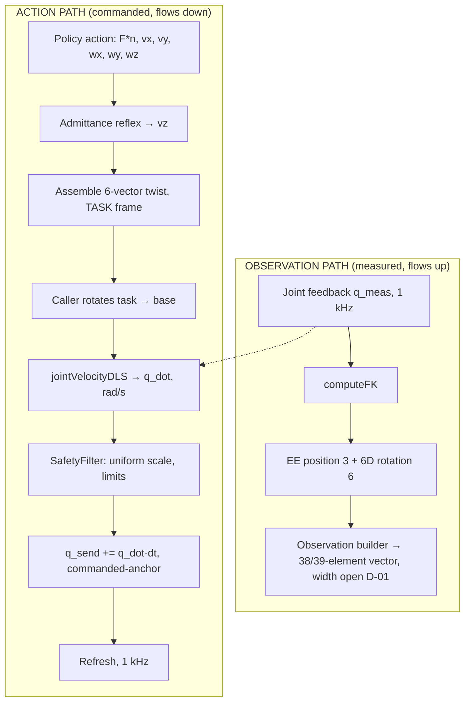

# kinova_kinematics — Design Document

**Scope.** Forward kinematics, the geometric Jacobian, the iterative pose solver, and the
differential inverse kinematics used inside the 1 kHz control loop (Phase 0, Step 6).

**Status.** FK, Jacobian, `solveIK`, `solveDLS` and `jointVelocityDLS` are implemented. FK,
Jacobian and `solveIK` pass analytic checks at the home configuration (z = 1.1873 m; symmetry
checks pass); the **hardware FK-vs-Kortex comparison is pending the tool-offset check (D-14,
22 Aug)**. The differential path (`jointVelocityDLS` / `solveDLS`) is unit-tested and
latency-benchmarked (Step 6.2, §9).

**Convention.** Classical Denavit–Hartenberg, 8 frames (rows 0–7), radians throughout. The
public API takes and returns radians; the deg↔rad seams are owned by the 1 kHz loop (D-25).

---

## 1. Where this library sits

The pipeline has two independent paths through this library. They must not share code.



`computeFK` serves the **observation** side. `jointVelocityDLS` serves the **action** side.
`computeJacobian` is called on the action side only, evaluated at the measured `q_meas`.

**`solveIK` is not used in the 1 kHz loop.** It is an iterative *pose* solver — it takes a
target pose and iterates to convergence. The loop needs a single-shot *velocity* solve at a
fixed 1 ms budget. In particular, the error-proportional damping heuristic inside `solveIK`
(`lambda = 0.5 * de.norm() + 1e-4`) is meaningful only when there is a pose error to be
proportional to. In a differential solve there is no pose error, so that heuristic must not
be carried over. `solveIK` remains for offline planning and test fixtures.

---

## 2. Components

| Function | Returns | Units | Notes |
|---|---|---|---|
| `computeFK(q)` | `Matrix4d` | m, base frame | Classical DH chain, 8 frames, incl. 0.113 m tool z-offset |
| `getPosition(T)` | `Vector3d` | m, base | Translation block |
| `getRotation(T)` | `Matrix3d` | — | Rotation block; first two columns are the 6D observation |
| `computeJacobian(q)` | `Matrix<double,6,7>` | see §4 | Geometric, numerical forward difference, step `eps = 1e-6`, fixed size |
| `solveDLS(J, twist, λ)` | `DlsResult` | see §4 | Linear-algebra core; **public** dependency-injection / test seam (D-26) |
| `jointVelocityDLS(q, twist, λ)` | `DlsResult` | see §4 | 1 kHz entry point; builds `J` internally, then calls `solveDLS` |
| `solveIK(...)` | `IKResult` | m, rad | Iterative LM + null-space joint-limit term. **Offline only.** |
| `jointLimitGradient(q)` | `VectorXd 7` | — | Secondary objective for `solveIK` |

The Jacobian is computed numerically by finite difference rather than analytically. This is
adequate for the 1 kHz budget (see §9) but it is a numerical approximation, and the choice of
`eps` trades truncation error against floating-point cancellation. It is a candidate for
replacement by an analytic Jacobian if later benchmarking shows a timing problem.

---

## 3. The differential problem

**Given** a desired end-effector twist `v` in the **base** frame, and the current measured
joint configuration `q_meas`, **find** joint velocities `q_dot` such that `J(q) · q_dot ≈ v`.

For the Gen3, `J` is **6×7**. Six equations, seven unknowns: the system is
**underdetermined**, not overdetermined. There is an infinite family of exact solutions and
the question is which one to pick, not how to best approximate an unreachable one.

This matters because it selects the formulation. The correct object is the **minimum-norm**
solution — the `q_dot` of smallest magnitude that achieves the twist:

```
q_dot = Jᵀ (J Jᵀ)⁻¹ v          (minimum-norm pseudoinverse, right inverse)
```

The least-squares form `(Jᵀ J)⁻¹ Jᵀ` is for the overdetermined case and is wrong here —
`Jᵀ J` is 7×7 and singular by construction for a 6×7 Jacobian.

---

## 4. Units and frames — stated before anything else

| Quantity | Symbol | Units | Frame |
|---|---|---|---|
| Input twist, linear rows 0–2 | `v_lin` | m/s | **base** |
| Input twist, angular rows 3–5 | `v_ang` | rad/s | **base** |
| Joint configuration | `q` | rad | joint space, order 1..7 |
| Output joint velocity | `q_dot` | **rad/s** | joint space, order 1..7 |
| Jacobian rows 0–2 | — | m/rad | — |
| Jacobian rows 3–5 | — | dimensionless | — |

**Two unit boundaries the caller owns, both of which are known bug sources:**

1. **Task frame → base frame.** The policy action and the admittance reflex work in the
   *task* frame (latched at CONTACT entry). `jointVelocityDLS` takes a **base-frame** twist.
   The rotation is the caller's responsibility, deliberately — see §7. Apply a
   **rotation only**, never the full 4×4 homogeneous transform: a twist is a vector pair,
   not a point, and applying the translation leaks a phantom offset.

2. **rad/s → deg/s.** This function returns **rad/s**. The 1 kHz loop integrates into
   `q_send`, which is in **degrees** (Kortex `feedback.actuators(i).position()` is degrees).
   The conversion must happen at the integration step:
   `q_send_deg += q_dot_rad_s * (180/π) * dt`. Omitting it produces motion that is
   57× too slow and looks exactly like a damping problem.

---

## 5. Why damping, and how λ is chosen

### 5.1 The failure the damping fixes

Write the pseudoinverse in terms of the singular values of `J`. Each singular direction is
scaled by `1/σ`. As the arm approaches a singularity some `σ → 0`, so `1/σ → ∞`, and a small
commanded twist in that direction demands an unbounded joint velocity. On hardware that is a
violent, uncommanded motion.

Damped least squares replaces the per-direction gain:

```
1/σ        →        σ / (σ² + λ²)
```

As `σ → 0` the damped gain also goes to **zero** rather than to infinity. The solve stops
trying to move in directions the arm cannot move in, instead of trying infinitely hard.

The damped minimum-norm solution is:

```
q_dot = Jᵀ (J Jᵀ + λ² I₆)⁻¹ v
```

### 5.2 The worst-case velocity bound

Let `g(σ) = σ / (σ² + λ²)`. Then

```
g'(σ) = (λ² − σ²) / (σ² + λ²)²
```

which is zero at `σ = λ`, giving the maximum

```
g_max = λ / (2λ²) = 1 / (2λ)
```

Therefore, for any commanded twist:

```
‖q_dot‖  ≤  ‖v‖ / (2λ)                                            (BOUND-1)
```

This is exact, derived, and is the number the SafetyFilter's clamp threshold is set from.
It is worst-case: it is attained only when the commanded twist aligns with a singular
direction whose singular value happens to equal λ.

### 5.3 Choosing λ — the tension, stated honestly

A single constant λ cannot satisfy both requirements at once:

| λ | Behaviour near singularity | Behaviour in normal operation |
|---|---|---|
| Large (e.g. 0.29) | Tight velocity bound, safe | Heavily damped. At a typical σ ≈ 0.3, roughly half the commanded velocity is lost |
| Small (e.g. 0.05) | BOUND-1 gives ‖q_dot‖ ≤ 10·‖v‖ — too loose to rely on | Accurate tracking |

This is a known property of constant-λ DLS, not a defect in this design. The literature
answer is variable damping (λ raised only as `σ_min` falls), which requires `σ_min` every
cycle — an SVD, which is not affordable inside a 1 ms budget alongside the Jacobian.

**Decision.** λ is held small and constant for tracking quality. The velocity bound is
enforced **downstream in the SafetyFilter**, not inside this function. BOUND-1 is what makes
the filter's clamp threshold defensible rather than arbitrary. The caller can compute a
`manipulability` metric (§8) to observe proximity to singularity and act on it.

**Provisional value: λ = 0.05.** This is a starting point, not a result. It is replaced by
the outcome of the 6.4 sweep (§9), which measures, at each λ:

- twist residual `‖J·q_dot − v‖` at a nominal, well-conditioned configuration
- peak `‖q_dot‖` at a deliberately near-singular configuration
- whether the measured peak respects BOUND-1

**λ is a per-call parameter** to `solveDLS` / `jointVelocityDLS`, so the sweep passes a
different value per run with no recompile. It is validated inside `solveDLS`:
`!(lambda > 0.0) || !std::isfinite(lambda)` rejects zero, negative, NaN and ±∞ (returns
`ok = false`, `qdot` zeroed).

**λ must be strictly positive.** At λ = 0 the damping vanishes and `J Jᵀ` may be singular,
so the LDLᵀ factorisation in §6 is no longer guaranteed.

### 5.4 The mixed-units defect — stated, not hidden

`λ² I₆` adds the *same scalar* to all six diagonal entries of `J Jᵀ`. But `J Jᵀ` does not have
uniform units. With linear Jacobian rows in m/rad and angular rows dimensionless, the blocks
of `J Jᵀ` carry units of m²/rad², m/rad, and 1 respectively. A single scalar λ is therefore
**dimensionally inconsistent** across the linear and angular parts of the system.

The practical consequence: the *effective* damping applied to translation and to rotation
differs by roughly the square of a characteristic length. A λ tuned for good translational
behaviour is not the λ that is right for rotation.

**This is a real defect and it is not fixed in v1.** It is recorded here so that it is not
later mistaken for a tuning problem.

*Proposal, NOT in the locked scope, flagged as scope creep and deferred to 6.5:* pre-multiply
the twist and the Jacobian by a diagonal weight `W = diag(1/L, 1/L, 1/L, 1, 1, 1)` with `L` a
characteristic arm length (order 0.5 m). This makes both blocks dimensionless and λ
dimensionally consistent. It changes the meaning of λ, so it must not be introduced silently
mid-sweep. Decide after the λ sweep, not during it.

The same wart applies to the Yoshikawa manipulability measure in §8.

---

## 6. Numerical method

`q_dot = Jᵀ (J Jᵀ + λ² I₆)⁻¹ v` is **not** evaluated by forming an inverse. It is evaluated as
a linear solve:

```
Step 1:  A = J Jᵀ + λ² I₆                       (6×6, symmetric, positive definite for λ > 0)
Step 2:  solve  A x = v   for x                 (LDLᵀ factorisation, x is 6×1)
Step 3:  q_dot = Jᵀ x                           (7×6 · 6×1 → 7×1)
```

**Why the 6×6 form.** The algebraic identity `Jᵀ(J Jᵀ + λ²I₆)⁻¹ = (Jᵀ J + λ²I₇)⁻¹Jᵀ` means
either could be used, but the left form factorises a 6×6 matrix and the right a 7×7. The 6×6
is cheaper and is the natural form for the underdetermined case.

**Why LDLᵀ.** It is a square-root-free symmetric factorisation `A = L D Lᵀ`, solved by three
triangular passes (forward substitution, diagonal scaling, back substitution). It exploits
symmetry and never forms an inverse; forming `A.inverse()` and multiplying computes more than
is needed and discards conditioning information. Because λ > 0 makes `A` strictly positive
definite, plain Cholesky (`LLT`) is also valid and marginally faster; **LDLᵀ is chosen for
backward stability and because the pivot diagonal is a free conditioning indicator**, and it
degrades gracefully if `A` becomes near-semidefinite. Revisit at 6.5 if timing demands.

*(The `A` matrix is fixed-size `Matrix<double,6,6>`, stack-allocated; `noalias()` suppresses
Eigen temporaries. No heap allocation on the 1 kHz path — confirmed by the tight p99.9 in §9.)*

---

## 7. API specification

```cpp
/**
 * @brief Result of one differential inverse-kinematics solve.
 */
struct DlsResult {
    Eigen::Matrix<double,7,1> qdot            = Eigen::Matrix<double,7,1>::Zero();
                                     ///< 7x1 joint velocities [rad/s], joint order 1..7
    Eigen::Matrix<double,6,1> twist_achieved  = Eigen::Matrix<double,6,1>::Zero();
                                     ///< 6x1 J*qdot, BASE frame [m/s; rad/s]. Differs from the
                                     ///< commanded twist by the damping residual.
    double lambda_used   = 0.0;      ///< Damping actually applied this cycle (mixed units, §5.4)
    double manipulability = std::numeric_limits<double>::quiet_NaN();
                                     ///< NOT computed here by design (D-20). NaN = "not computed";
                                     ///< 0.0 would falsely mean "exactly singular" (P22).
    bool   ok            = false;    ///< false => qdot is zeroed; caller MUST NOT command it
};

/**
 * @brief Linear-algebra core: solve (J·Jᵀ + λ²I) x = twist, qdot = Jᵀx. PUBLIC (D-26) so a
 *        test can inject a known J directly. Guards λ (>0, finite) and finiteness of J/twist.
 */
DlsResult solveDLS(const Eigen::Matrix<double,6,7>& J,
                   const Eigen::Matrix<double,6,1>& twist_des,
                   double lambda) const;

/**
 * @brief Single-shot damped least-squares differential IK for the 1 kHz loop.
 *
 * @param q_meas_rad  Current MEASURED joint configuration [rad], order 1..7. Use q_meas from
 *                    feedback, not commanded q_send: the Jacobian is evaluated where the arm is.
 * @param twist_des   Desired EE twist, BASE frame. Rows 0-2 linear [m/s], 3-5 angular [rad/s].
 *                    The caller performs any task→base rotation.
 * @param lambda      Damping (>0, finite). Provisional 0.05; set by the 6.4 sweep.
 * @return DlsResult. On any guard failure, ok == false and qdot is zeroed.
 *
 * @note Returns rad/s. The caller converts to degrees before integrating into q_send.
 * @note Performs NO clamping, NO null-space projection, NO integration (see below).
 */
DlsResult jointVelocityDLS(const std::array<double,7>& q_meas_rad,
                           const Eigen::Matrix<double,6,1>& twist_des,
                           double lambda) const;
```

### Not this function's job — and why

Each of these is excluded deliberately. Each belongs somewhere else in the stack.

| Excluded | Why | Where it lives |
|---|---|---|
| **Velocity clamping** | Clamping here would silently distort the twist direction and hide it from the safety layer. Safety must be enforced in one auditable place. | **SafetyFilter**, downstream |
| **Null-space projection** | The 7-DOF redundancy is real and worth using, but a secondary objective changes `q_dot` for reasons unrelated to the commanded twist. Introducing it before the primary solve is characterised makes the λ sweep uninterpretable. | Deferred. Post-Phase-0 decision. |
| **Task → base rotation** | The task frame is latched at CONTACT entry and owned by the contact state machine. Rotating inside the IK would give this library a dependency on task state it has no business holding. | Caller (1 kHz loop) |
| **Integration to position** | `q_send` is the loop's integrator state under the commanded-anchor scheme. A kinematics library must be stateless with respect to the control loop. | 1 kHz loop |
| **Joint-limit checking** | Same argument as clamping: one auditable safety layer. | SafetyFilter |

---

## 8. Manipulability — DEFERRED to 6.5

`DlsResult::manipulability` defaults to `quiet_NaN()` and is **not computed** in `solveDLS`
(D-20). The metric that will report proximity to singularity is **not yet chosen**. Candidates:

| Candidate | Cost | Sensitivity near singularity | Note |
|---|---|---|---|
| Yoshikawa `w = sqrt(det(J Jᵀ))` | One 6×6 determinant | Goes to zero, but as a *product* of all σ — one small σ can be masked by large others | Carries the §5.4 mixed-units defect |
| `σ_min` from SVD | Full 6×7 SVD | Direct and unambiguous | Likely unaffordable at 1 kHz — measure before rejecting |
| `det(J Jᵀ + λ²I)` as proxy | Free — already factorised in §6 | Biased by λ, floors out rather than reaching zero | Cheapest; least meaningful |
| Condition number `σ_max/σ_min` | Full SVD | Direct | Same cost objection |

**Decision criterion, to be applied at 6.5:** measure the wall-clock cost of each against the
remaining budget (§9), then pick the most sensitive metric that fits. Do not pick on
principle before the timing is measured. The 21 Aug monitor computes `sqrt(det(J Jᵀ))` itself,
since the struct field stays NaN.

*Note:* the Week 16 visual-servoing work already plans to monitor `sqrt(det(J Jᵀ))`. If
Yoshikawa is selected here, that is one metric across the project rather than two.

---

## 9. Timing budget

The cycle is 1000 µs. Measured on hardware, the `Refresh()` UDP round-trip consumes
approximately 350 µs mean. That leaves roughly 650 µs, from which the IK, the admittance
reflex, the safety filter and the observation build must all be paid.

Per call, `jointVelocityDLS` costs: one numerical Jacobian (7 perturbation FK evaluations
plus the base FK, so 8 DH chain evaluations), one 6×7 · 7×6 product, one 6×6 LDLᵀ
factorisation and solve, one 7×6 matrix–vector product.

**Measured — Step 6.2** (`benchmark_dls`, N = 1,000,000, `RelWithDebInfo`, SCHED_FIFO
`chrt -f 80`, `taskset -c 2` on a confirmed P-core):

| Metric | jointVelocityDLS |
|---|---|
| mean | **1.90 µs** |
| p50 | 1.86 µs |
| p99 | 2.35 µs |
| p99.9 | **3.04 µs** |
| max (1 in 10⁶) | 94.4 µs |
| clock-read floor | 9 ns |
| cycle budget | 1000 µs |

The IK stage uses **~0.2 % of the cycle typically and ~0.3 % at the 1-in-1000 tail** — decisive
headroom. The tight p99.9-vs-mean gap is the evidence that the fixed-size path does not
heap-allocate. The dominant term is expected to be the numerical Jacobian, not the linear
algebra, but the Jacobian/solve **split is not separately measured** — that remains an
expectation, to be split at 6.5 only if a budget problem ever appears (it has not).

---

## 10. Failure modes

| Mode | Detection | Behaviour |
|---|---|---|
| `q_meas_rad` contains NaN/Inf | per-joint `isfinite` in `jointVelocityDLS` | `ok = false`, `qdot` zeroed, before it spreads |
| `twist_des` / `J` contains NaN/Inf | `allFinite()` in `solveDLS` | `ok = false`, `qdot` zeroed |
| λ ≤ 0 or non-finite | `!(lambda > 0.0) \|\| !isfinite(lambda)` in `solveDLS` | `ok = false`, `qdot` zeroed |
| LDLᵀ reports failure | Eigen `info() != Success` | `ok = false`, `qdot` zeroed |
| Solve produces non-finite `y` | `y.allFinite()` after solve | `ok = false`, `qdot` zeroed |
| Near-singular configuration | (caller-computed manipulability) | **Not a failure.** Damping handles it; `ok` stays true. The caller decides. |
| `q_meas` outside joint limits | Not checked here | Caller / SafetyFilter responsibility (§7) |

**`ok == false` means `qdot` must not be commanded.** The 1 kHz loop's correct response is to
hold `q_send` at its previous value — *not* to skip the `Refresh()` call, which would trip the
firmware watchdog. Holding position is the safe degenerate command. (Twist size is now a
compile-time invariant — `Eigen::Matrix<double,6,1>` — so a runtime size check is no longer
needed.)

---

## 11. Testing strategy (off-robot)

All tests run against the mock build and require no arm. `solveDLS` being public is what makes
the linear algebra directly testable with an injected `J` (D-26).

**Correctness**
1. **Round trip.** Pick a well-conditioned `q`, choose an arbitrary `q_dot_true`, compute
   `v = J·q_dot_true`, solve. With small λ, `‖J·q_dot − v‖` must be small (`EXPECT_NEAR`, not
   exact — damping guarantees a residual).
2. **Minimum norm.** For the same `v`, the returned `‖q_dot‖` must not exceed `‖q_dot_true‖`
   by more than the damping residual. The minimum-norm test uses a **duplicate-column**
   Jacobian so the null space is non-trivial and the claim is falsifiable (not a tautology).
3. **Zero twist.** `v = 0` must give `q_dot = 0`.
4. **Linearity.** `solve(2v) == 2·solve(v)`, within tolerance.

**Damping behaviour**
5. **Bounded near singularity.** Near-singular configuration, twist along the degenerate
   direction: `‖q_dot‖` must stay finite and respect BOUND-1.
6. **λ monotonicity.** Sweep λ upward at fixed config: residual increases monotonically,
   `‖q_dot‖` decreases monotonically.
7. **λ sweep (6.4 deliverable).** Table of λ vs residual (nominal) and peak `‖q_dot‖`
   (near-singular). Selects production λ; goes in the repo.

**Robustness**
8. NaN twist, NaN `q_meas`, λ = 0 / negative / ±∞ — all handled per §10 (`DlsRejectsNan`).

**Determinism.** No randomness, or fixed logged seed.

---

## 12. Open items

| Item | Status | Blocks |
|---|---|---|
| Production λ | Provisional 0.05; set by the 6.4 sweep. Note: at σ ≈ 0.105 (ordinary pose) attenuation is 0.81 — ~19 % lost, 0.05 may be too aggressive | Hardware integration (6.6+) |
| Tool offset as config parameter | Value 0.113 m applied, but still a **literal** in `computeFK`. D-14 requires it be a config parameter | Any reported hardware FK/IK number |
| Jacobian/solve timing split | Total measured (§9); split not measured | 6.5, only if a budget problem appears |
| Manipulability metric | Deferred to 6.5 on measured timing; field stays NaN | 6.5 |
| Mixed-units λ (§5.4) | Documented, not fixed. Weighted-Jacobian proposal deferred | Nothing in v1 |
| `solveIK` `dx`/`dw` guard | `Vector3d dx, dw;` uninitialised; UB if `max_iterations ≤ 0`. Zero-init or guard | Before `solveIK` is relied on |
| Joint velocity limits | **Not in this library.** Position limits hardcoded from the datasheet; velocity limits not. Verify against the Gen3 user guide | SafetyFilter |

---

## 13. Verification status

| Claim | Basis |
|---|---|
| Classical DH is the correct convention for the Gen3 | z = 1.1873 m at home (analytic FK); symmetry checks pass. **Hardware FK-vs-Kortex comparison pending D-14** |
| `J` is 6×7 and the system is underdetermined | Structural, from the 7-DOF arm |
| `g_max = 1/(2λ)` at `σ = λ` | **Derived**, §5.2. Reproducible by hand. |
| LDLᵀ needs no matrix inverse | Property of the factorisation |
| `jointVelocityDLS` mean 1.90 µs / p99.9 3.04 µs | **Measured**, Step 6.2 (§9), N = 10⁶, RT + pinned |
| No heap allocation on the 1 kHz path | Inferred from the tight p99.9-vs-mean gap; fixed-size Eigen throughout |
| `Refresh()` costs ~350 µs mean | **Measured on hardware**, Step 3 |
| Numerical Jacobian dominates the per-call cost | **UNVERIFIED expectation.** Split not measured. |
| Gen3 joint *velocity* limits | **UNVERIFIED.** Not in this library. Read from the Gen3 user guide before the SafetyFilter is written. |

---

*Kinova Gen3 force-conditioned skills — Advanced Biomechatronics and Locomotion Lab,
Carleton University. Phase 0, Step 6.2.*
