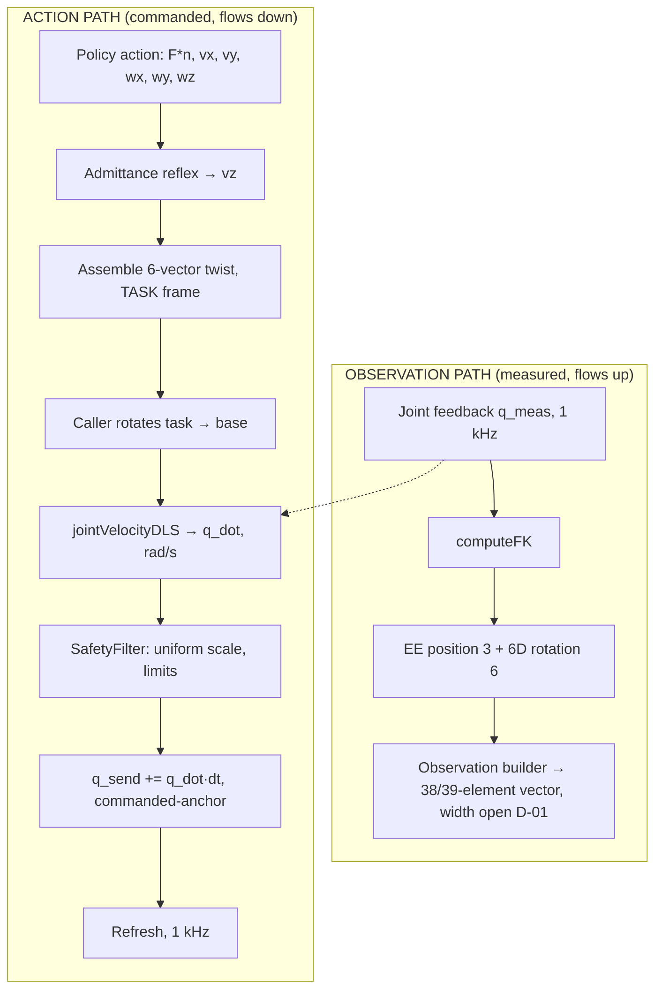

# kinova_kinematics — Design Document

**Scope.** Forward kinematics, the geometric Jacobian, the iterative pose solver, and the
differential inverse kinematics used inside the 1 kHz control loop (Phase 0, Step 6).

**Status.** FK, Jacobian, `solveIK`, `solveDLS` and `jointVelocityDLS` are implemented. FK,
Jacobian and `solveIK` pass analytic checks at the home configuration (z = 1.1873 m; symmetry
checks pass); the **hardware FK-vs-Kortex comparison is pending the tool-offset check (D-14,
22 Aug)**. The differential path (`jointVelocityDLS` / `solveDLS`) is unit-tested and
latency-benchmarked (Step 6.2, §9).

**Convention.** Classical Denavit–Hartenberg, 8 frames (rows 0–7), radians throughout. The
public API takes and returns radians; the deg↔rad seams are owned by the 1 kHz loop (D-25).

---

## 1. Where this library sits

The pipeline has two independent paths through this library. They must not share code.



`computeFK` serves the **observation** side. `jointVelocityDLS` serves the **action** side.
`computeJacobian` is called on the action side only, evaluated at the measured `q_meas`.

**`solveIK` is not used in the 1 kHz loop.** It is an iterative *pose* solver — it takes a
target pose and iterates to convergence. The loop needs a single-shot *velocity* solve at a
fixed 1 ms budget. In particular, the error-proportional damping heuristic inside `solveIK`
(`lambda = 0.5 * de.norm() + 1e-4`) is meaningful only when there is a pose error to be
proportional to. In a differential solve there is no pose error, so that heuristic must not
be carried over. `solveIK` remains for offline planning and test fixtures.

---

## 2. Components

| Function | Returns | Units | Notes |
|---|---|---|---|
| `computeFK(q)` | `Matrix4d` | m, base frame | Classical DH chain, 8 frames, incl. 0.113 m tool z-offset |
| `getPosition(T)` | `Vector3d` | m, base | Translation block |
| `getRotation(T)` | `Matrix3d` | — | Rotation block; first two columns are the 6D observation |
| `computeJacobian(q)` | `Matrix<double,6,7>` | see §4 | Geometric, numerical forward difference, step `eps = 1e-6`, fixed size |
| `solveDLS(J, twist, λ)` | `DlsResult` | see §4 | Linear-algebra core; **public** dependency-injection / test seam (D-26) |
| `jointVelocityDLS(q, twist, λ)` | `DlsResult` | see §4 | 1 kHz entry point; builds `J` internally, then calls `solveDLS` |
| `solveIK(...)` | `IKResult` | m, rad | Iterative LM + null-space joint-limit term. **Offline only.** |
| `jointLimitGradient(q)` | `VectorXd 7` | — | Secondary objective for `solveIK` |

The Jacobian is computed numerically by finite difference rather than analytically. This is
adequate for the 1 kHz budget (see §9) but it is a numerical approximation, and the choice of
`eps` trades truncation error against floating-point cancellation. It is a candidate for
replacement by an analytic Jacobian if later benchmarking shows a timing problem.

---

## 3. The differential problem

**Given** a desired end-effector twist `v` in the **base** frame, and the current measured
joint configuration `q_meas`, **find** joint velocities `q_dot` such that `J(q) · q_dot ≈ v`.

For the Gen3, `J` is **6×7**. Six equations, seven unknowns: the system is
**underdetermined**, not overdetermined. There is an infinite family of exact solutions and
the question is which one to pick, not how to best approximate an unreachable one.

This matters because it selects the formulation. The correct object is the **minimum-norm**
solution — the `q_dot` of smallest magnitude that achieves the twist:

```
q_dot = Jᵀ (J Jᵀ)⁻¹ v          (minimum-norm pseudoinverse, right inverse)
```

The least-squares form `(Jᵀ J)⁻¹ Jᵀ` is for the overdetermined case and is wrong here —
`Jᵀ J` is 7×7 and singular by construction for a 6×7 Jacobian.

---

## 4. Units and frames — stated before anything else

| Quantity | Symbol | Units | Frame |
|---|---|---|---|
| Input twist, linear rows 0–2 | `v_lin` | m/s | **base** |
| Input twist, angular rows 3–5 | `v_ang` | rad/s | **base** |
| Joint configuration | `q` | rad | joint space, order 1..7 |
| Output joint velocity | `q_dot` | **rad/s** | joint space, order 1..7 |
| Jacobian rows 0–2 | — | m/rad | — |
| Jacobian rows 3–5 | — | dimensionless | — |

**Two unit boundaries the caller owns, both of which are known bug sources:**

1. **Task frame → base frame.** The policy action and the admittance reflex work in the
   *task* frame (latched at CONTACT entry). `jointVelocityDLS` takes a **base-frame** twist.
   The rotation is the caller's responsibility, deliberately — see §7. Apply a
   **rotation only**, never the full 4×4 homogeneous transform: a twist is a vector pair,
   not a point, and applying the translation leaks a phantom offset.

2. **rad/s → deg/s.** This function returns **rad/s**. The 1 kHz loop integrates into
   `q_send`, which is in **degrees** (Kortex `feedback.actuators(i).position()` is degrees).
   The conversion must happen at the integration step:
   `q_send_deg += q_dot_rad_s * (180/π) * dt`. Omitting it produces motion that is
   57× too slow and looks exactly like a damping problem.

---

## 5. Why damping, and how λ is chosen

### 5.1 The failure the damping fixes

Write the pseudoinverse in terms of the singular values of `J`. Each singular direction is
scaled by `1/σ`. As the arm approaches a singularity some `σ → 0`, so `1/σ → ∞`, and a small
commanded twist in that direction demands an unbounded joint velocity. On hardware that is a
violent, uncommanded motion.

Damped least squares replaces the per-direction gain:

```
1/σ        →        σ / (σ² + λ²)
```

As `σ → 0` the damped gain also goes to **zero** rather than to infinity. The solve stops
trying to move in directions the arm cannot move in, instead of trying infinitely hard.

The damped minimum-norm solution is:

```
q_dot = Jᵀ (J Jᵀ + λ² I₆)⁻¹ v
```

### 5.2 The worst-case velocity bound

Let `g(σ) = σ / (σ² + λ²)`. Then

```
g'(σ) = (λ² − σ²) / (σ² + λ²)²
```

which is zero at `σ = λ`, giving the maximum

```
g_max = λ / (2λ²) = 1 / (2λ)
```

Therefore, for any commanded twist:

```
‖q_dot‖  ≤  ‖v‖ / (2λ)                                            (BOUND-1)
```

This is exact, derived, and is the number the SafetyFilter's clamp threshold is set from.
It is worst-case: it is attained only when the commanded twist aligns with a singular
direction whose singular value happens to equal λ.

### 5.3 Choosing λ — the tension, stated honestly

A single constant λ cannot satisfy both requirements at once:

| λ | Behaviour near singularity | Behaviour in normal operation |
|---|---|---|
| Large (e.g. 0.29) | Tight velocity bound, safe | Heavily damped. At the measured σ = 0.297 (§5.4.1) 49 % of the commanded velocity is lost; at the worst σ measured at that pose, 0.152, the loss is 78 % |
| Small (e.g. 0.05) | BOUND-1 gives ‖q_dot‖ ≤ 10·‖v‖ — too loose to rely on | Accurate tracking |

This is a known property of constant-λ DLS, not a defect in this design. The literature
answer is variable damping (λ raised only as `σ_min` falls), which requires `σ_min` every
cycle — an SVD, which is not affordable inside a 1 ms budget alongside the Jacobian.

**Decision.** λ is held small and constant for tracking quality. The velocity bound is
enforced **downstream in the SafetyFilter**, not inside this function. BOUND-1 is what makes
the filter's clamp threshold defensible rather than arbitrary. The caller can compute a
`manipulability` metric (§8) to observe proximity to singularity and act on it.

**Provisional value: λ = 0.05.** This is a starting point, not a result. It is replaced by
the outcome of the 6.4 sweep (§9), which measures, at each λ:

- twist residual `‖J·q_dot − v‖` at a nominal, well-conditioned configuration
- peak `‖q_dot‖` at a deliberately near-singular configuration
- whether the measured peak respects BOUND-1

**λ is a per-call parameter** to `solveDLS` / `jointVelocityDLS`, so the sweep passes a
different value per run with no recompile. It is validated inside `solveDLS`:
`!(lambda > 0.0) || !std::isfinite(lambda)` rejects zero, negative, NaN and ±∞ (returns
`ok = false`, `qdot` zeroed).

**λ must be strictly positive.** At λ = 0 the damping vanishes and `J Jᵀ` may be singular,
so the LDLᵀ factorisation in §6 is no longer guaranteed.

### 5.4 The mixed-units defect — stated, not hidden

`λ² I₆` adds the *same scalar* to all six diagonal entries of `J Jᵀ`. But `J Jᵀ` does not have
uniform units. With linear Jacobian rows in m/rad and angular rows dimensionless, the blocks
of `J Jᵀ` carry units of m²/rad², m/rad, and 1 respectively. A single scalar λ is therefore
**dimensionally inconsistent** across the linear and angular parts of the system.

The practical consequence: the *effective* damping applied to translation and to rotation
differs by roughly the square of a characteristic length. A λ tuned for good translational
behaviour is not the λ that is right for rotation.

**This is a real defect and it is not fixed in v1.** It is recorded here so that it is not
later mistaken for a tuning problem.

*Proposal, NOT in the locked scope, flagged as scope creep and deferred to 6.5:* pre-multiply
the twist and the Jacobian by a diagonal weight `W = diag(1/L, 1/L, 1/L, 1, 1, 1)` with `L` a
characteristic arm length (order 0.5 m). This makes both blocks dimensionless and λ
dimensionally consistent. It changes the meaning of λ, so it must not be introduced silently
mid-sweep. Decide after the λ sweep, not during it.

The same wart applies to the Yoshikawa manipulability measure in §8.

*This is not an idiosyncratic worry.* Dimensional inhomogeneity of the Jacobian is a known
obstacle to using the condition number as a measure of invertibility, and the "characteristic
length" was introduced in the literature specifically to cope with it. Several selection
criteria for that length exist (minimising the condition number; scaling by maximum desired
forces). **References unverified — read the primary sources before citing.**

### 5.4.1 λ is robot-specific — measured

λ is a threshold on σ: the gain `g(σ) = σ/(σ²+λ²)` peaks at `σ = λ` (§5.2). λ is therefore
only meaningful relative to the σ spectrum of *this* arm, and that spectrum depends on the
arm's geometry.

**σ has no consistent unit.** It is a ratio of task-space output to joint rate. For a
translation-dominated singular direction that is m/rad; for a rotation-dominated one it is
dimensionless; for a mixed direction it is neither. λ is compared against σ, so λ has no
consistent unit either. This is the §5.4 defect restated in the form that matters for tuning.

**Measured spectrum at `kHomeRad`** (`test_dls.cpp:122`, tool offset 0.113 m, reach 0.716 m).
`u` is the left singular vector — the task-space direction that mode produces. "% linear" is
`‖u_v‖²`, the translational share of that direction's energy. "Lost" is `λ²/(σ²+λ²)`, the
fraction of commanded task velocity discarded by damping.

| σ | % linear | lost at λ = 0.05 | lost at λ = 0.29 |
|---|---|---|---|
| 1.893 | 16 | 0.1 % | 2.3 % |
| 1.798 | 19 | 0.1 % | 2.5 % |
| 1.175 | 1 | 0.2 % | 5.7 % |
| 0.297 | 99 | 2.8 % | 49 % |
| 0.180 | 84 | 7.1 % | 72 % |
| 0.152 | 80 | 9.7 % | 78 % |

Two readings:

- **Damping engages on translation, not rotation**, at this pose. The three rotation-dominated
  modes lose under 0.3 % at λ = 0.05. This is the §5.4 defect in measured form.
- §5.3's "typical σ ≈ 0.3" was optimistic: 0.297 is the *largest* of the three small values
  here. `kHomeRad` is also not the worst pose observed — §12 records σ ≈ 0.105 elsewhere.

#### Link-scale sensitivity — why λ does not transfer

Same solver, same λ, geometrically similar arm of a different size. Joint configuration is
**identical in every row** (`kHomeRad`); only the DH `d` values and the tool offset are
multiplied by the link scale factor k.

| Link scale factor k (all link lengths × this; k=1 is the real Gen3) | Tool reach ‖p‖ [m] | σ_min of the full 6×7 Jacobian | σ_min(k) ÷ σ_min(k=1) — how much σ_min actually shrank | k, for comparison — how much it *would* shrink if all of J scaled | Translational share ‖u_v‖² of that direction [%] | Rotational share ‖u_ω‖² [%] | Velocity lost along that direction at λ = 0.05 |
|---|---|---|---|---|---|---|---|
| 1.0 | 0.716 | 0.1519 | 1.0000 | 1.0000 | 80.1 | 19.9 | 9.8 % |
| 0.5 | 0.358 | 0.0823 | 0.5418 | 0.5000 | 94.2 | 5.8 | 27.0 % |
| 0.1 | 0.072 | 0.0169 | 0.1113 | 0.1000 | 99.8 | 0.2 | 89.7 % |

Three findings:

1. **σ_min shrinks with the arm, but not proportionally.** Columns 4 and 5 disagree: 0.1113
   against 0.1000. Scaling the arm scales `Jv` by k and leaves `Jw` untouched, so only half
   the matrix moves. "σ scales with link length" is *false* as a flat statement — only
   translation-dominated σ scale, and only approximately.
2. **The singular direction re-orients.** Column 6 runs 80.1 → 94.2 → 99.8 %. As `Jv` shrinks,
   the worst direction becomes almost purely translational. No closed-form correction factor
   exists; the SVD must be recomputed, not rescaled.
3. **A fixed λ becomes destructive on a smaller arm.** The λ = 0.05 that costs 9.8 % on the
   Gen3 costs 89.7 % on a tenth-scale arm at the *same* joint configuration — a configuration
   nowhere near a kinematic singularity.

λ lives in the adapter, below the interface contract. A per-robot λ therefore does not weaken
the architectural-portability claim; it is exactly the kind of robot-specific quantity the
contract exists to keep below the boundary.

#### Procedure for a new robot

Derived from §5.2, not taken from the literature.

1. **Measure the spectrum.** Sample poses the arm will actually visit, compute J, take the
   SVD, record the distribution of the smallest translation-dominated σ.
2. **Upper bound, from accuracy.** For a tolerable fractional velocity loss L:
   `λ ≤ σ · sqrt(L / (1 − L))`. Gen3 check: σ = 0.152, L = 10 % → λ ≤ 0.0507. This reproduces
   the shipped 0.05 and its 9.7 % loss.
3. **Lower bound, from the velocity cap** — *only if damping is the sole limiter.* From
   BOUND-1, `‖q̇‖ ≤ ‖v‖/(2λ)`, so `λ ≥ ‖v‖_max / (2·q̇_cap)`. Gen3 check:
   0.559 / (2 × 2.094) = 0.133.
4. **Verify by sweep** (§11 item 7) on the new arm.

**Note that steps 2 and 3 are incompatible on the Gen3: 0.05 < 0.133.** That is deliberate,
not an error. λ = 0.05 permits `‖q̇‖ ≤ 0.559/0.10 = 5.59 rad/s` against a 2.094 rad/s cap —
which is why SafetyFilter Site 3 is measured firing at 3.39 rad/s in normal operation rather
than acting as a last-resort guard. **λ buys accuracy; Site 3 enforces the cap.** Step 3 is
binding only on a robot with no Site-3 equivalent.

*Alternative, deferred:* adaptive λ keyed to an online σ_min estimate (Chiaverini et al. 1994;
Maciejewski & Klein 1988 — **both unverified, read before citing**) removes per-robot tuning
entirely. Cost is a σ_min estimate every cycle at 1 kHz, which is **not measured** and is a
different and more expensive operation than the LDLᵀ solve in §6. Forcing trigger: decide
before a second robot enters the MuJoCo environment.

**Provenance for all numbers in §5.4.1.** COMPUTED, September 2026, by an independent Python
reimplementation of the repo DH table — *not* by `computeJacobian`. Validated two ways: flange
z = 1.1873 m at q = 0 (matches the C++ FK), and analytic `Jv` versus central finite difference
agreeing to 1.4e-10 at a random non-singular pose. **Not yet reproduced from `computeJacobian`
in C++** — do that before citing externally.

---

## 6. Numerical method

`q_dot = Jᵀ (J Jᵀ + λ² I₆)⁻¹ v` is **not** evaluated by forming an inverse. It is evaluated as
a linear solve:

```
Step 1:  A = J Jᵀ + λ² I₆                       (6×6, symmetric, positive definite for λ > 0)
Step 2:  solve  A x = v   for x                 (LDLᵀ factorisation, x is 6×1)
Step 3:  q_dot = Jᵀ x                           (7×6 · 6×1 → 7×1)
```

**Why the 6×6 form.** The algebraic identity `Jᵀ(J Jᵀ + λ²I₆)⁻¹ = (Jᵀ J + λ²I₇)⁻¹Jᵀ` means
either could be used, but the left form factorises a 6×6 matrix and the right a 7×7. The 6×6
is cheaper and is the natural form for the underdetermined case.

**Why LDLᵀ.** It is a square-root-free symmetric factorisation `A = L D Lᵀ`, solved by three
triangular passes (forward substitution, diagonal scaling, back substitution). It exploits
symmetry and never forms an inverse; forming `A.inverse()` and multiplying computes more than
is needed and discards conditioning information. Because λ > 0 makes `A` strictly positive
definite, plain Cholesky (`LLT`) is also valid and marginally faster; **LDLᵀ is chosen for
backward stability and because the pivot diagonal is a free conditioning indicator**, and it
degrades gracefully if `A` becomes near-semidefinite. Revisit at 6.5 if timing demands.

*(The `A` matrix is fixed-size `Matrix<double,6,6>`, stack-allocated; `noalias()` suppresses
Eigen temporaries. No heap allocation on the 1 kHz path — confirmed by the tight p99.9 in §9.)*

---

## 7. API specification

```cpp
/**
 * @brief Result of one differential inverse-kinematics solve.
 */
struct DlsResult {
    Eigen::Matrix<double,7,1> qdot            = Eigen::Matrix<double,7,1>::Zero();
                                     ///< 7x1 joint velocities [rad/s], joint order 1..7
    Eigen::Matrix<double,6,1> twist_achieved  = Eigen::Matrix<double,6,1>::Zero();
                                     ///< 6x1 J*qdot, BASE frame [m/s; rad/s]. Differs from the
                                     ///< commanded twist by the damping residual.
    double lambda_used   = 0.0;      ///< Damping actually applied this cycle (mixed units, §5.4)
    double manipulability = std::numeric_limits<double>::quiet_NaN();
                                     ///< NOT computed here by design (D-20). NaN = "not computed";
                                     ///< 0.0 would falsely mean "exactly singular" (P22).
    bool   ok            = false;    ///< false => qdot is zeroed; caller MUST NOT command it
};

/**
 * @brief Linear-algebra core: solve (J·Jᵀ + λ²I) x = twist, qdot = Jᵀx. PUBLIC (D-26) so a
 *        test can inject a known J directly. Guards λ (>0, finite) and finiteness of J/twist.
 */
DlsResult solveDLS(const Eigen::Matrix<double,6,7>& J,
                   const Eigen::Matrix<double,6,1>& twist_des,
                   double lambda) const;

/**
 * @brief Single-shot damped least-squares differential IK for the 1 kHz loop.
 *
 * @param q_meas_rad  Current MEASURED joint configuration [rad], order 1..7. Use q_meas from
 *                    feedback, not commanded q_send: the Jacobian is evaluated where the arm is.
 * @param twist_des   Desired EE twist, BASE frame. Rows 0-2 linear [m/s], 3-5 angular [rad/s].
 *                    The caller performs any task→base rotation.
 * @param lambda      Damping (>0, finite). Provisional 0.05; set by the 6.4 sweep.
 * @return DlsResult. On any guard failure, ok == false and qdot is zeroed.
 *
 * @note Returns rad/s. The caller converts to degrees before integrating into q_send.
 * @note Performs NO clamping, NO null-space projection, NO integration (see below).
 */
DlsResult jointVelocityDLS(const std::array<double,7>& q_meas_rad,
                           const Eigen::Matrix<double,6,1>& twist_des,
                           double lambda) const;
```

### Not this function's job — and why

Each of these is excluded deliberately. Each belongs somewhere else in the stack.

| Excluded | Why | Where it lives |
|---|---|---|
| **Velocity clamping** | Clamping here would silently distort the twist direction and hide it from the safety layer. Safety must be enforced in one auditable place. | **SafetyFilter**, downstream |
| **Null-space projection** | The 7-DOF redundancy is real and worth using, but a secondary objective changes `q_dot` for reasons unrelated to the commanded twist. Introducing it before the primary solve is characterised makes the λ sweep uninterpretable. | Deferred. Post-Phase-0 decision. |
| **Task → base rotation** | The task frame is latched at CONTACT entry and owned by the contact state machine. Rotating inside the IK would give this library a dependency on task state it has no business holding. | Caller (1 kHz loop) |
| **Integration to position** | `q_send` is the loop's integrator state under the commanded-anchor scheme. A kinematics library must be stateless with respect to the control loop. | 1 kHz loop |
| **Joint-limit checking** | Same argument as clamping: one auditable safety layer. | SafetyFilter |

---

## 8. Manipulability — DEFERRED to 6.5

`DlsResult::manipulability` defaults to `quiet_NaN()` and is **not computed** in `solveDLS`
(D-20). The metric that will report proximity to singularity is **not yet chosen**. Candidates:

| Candidate | Cost | Sensitivity near singularity | Note |
|---|---|---|---|
| Yoshikawa `w = sqrt(det(J Jᵀ))` | One 6×6 determinant | Goes to zero, but as a *product* of all σ — one small σ can be masked by large others | Carries the §5.4 mixed-units defect |
| `σ_min` from SVD | Full 6×7 SVD | Direct and unambiguous | Likely unaffordable at 1 kHz — measure before rejecting |
| `det(J Jᵀ + λ²I)` as proxy | Free — already factorised in §6 | Biased by λ, floors out rather than reaching zero | Cheapest; least meaningful |
| Condition number `σ_max/σ_min` | Full SVD | Direct | Same cost objection |

**Decision criterion, to be applied at 6.5:** measure the wall-clock cost of each against the
remaining budget (§9), then pick the most sensitive metric that fits. Do not pick on
principle before the timing is measured. The 21 Aug monitor computes `sqrt(det(J Jᵀ))` itself,
since the struct field stays NaN.

*Note:* the Week 16 visual-servoing work already plans to monitor `sqrt(det(J Jᵀ))`. If
Yoshikawa is selected here, that is one metric across the project rather than two.

---

## 9. Timing budget

The cycle is 1000 µs. Measured on hardware, the `Refresh()` UDP round-trip consumes
approximately 350 µs mean. That leaves roughly 650 µs, from which the IK, the admittance
reflex, the safety filter and the observation build must all be paid.

### 9.1 Inverse kinematics — `jointVelocityDLS`

Per call, `jointVelocityDLS` costs: one numerical Jacobian (7 perturbation FK evaluations
plus the base FK, so 8 DH chain evaluations), one 6×7 · 7×6 product, one 6×6 LDLᵀ
factorisation and solve, one 7×6 matrix–vector product.

**Measured — Step 6.2** (`benchmark_dls`, N = 1,000,000, `RelWithDebInfo`, SCHED_FIFO
`chrt -f 80`, `taskset -c 2` on a confirmed P-core):

| Metric | jointVelocityDLS |
|---|---|
| mean | **1.90 µs** |
| p50 | 1.86 µs |
| p99 | 2.35 µs |
| p99.9 | **3.04 µs** |
| max (1 in 10⁶) | 94.4 µs |
| clock-read floor | 9 ns |
| cycle budget | 1000 µs |

The IK stage uses **~0.2 % of the cycle typically and ~0.3 % at the 1-in-1000 tail** — decisive
headroom. The tight p99.9-vs-mean gap is the evidence that the fixed-size path does not
heap-allocate. The dominant term is expected to be the numerical Jacobian, not the linear
algebra, but the Jacobian/solve **split is not separately measured** — that remains an
expectation, to be split at 6.5 only if a budget problem ever appears (it has not).

**Build flags are part of the number.** `-O2 -g -DNDEBUG -std=gnu++17`, confirmed in
`compile_commands.json` on 4 Sep 2026. Eigen relies on inlining to collapse expression
templates; at `-O0` that collapse does not happen and the measurement is meaningless.

### 9.2 Safety filter — three sites

**Measured — Step 6.4** (`benchmark_safety_filter`, N = 1,000,000 per scenario, identical
protocol to §9.1 — same build type, same `chrt -f 80 taskset -c 2`, which is what makes the
two numbers additive). Four scenarios, because the filter has data-dependent branches and
therefore no single worst case. Full rationale and bounds: `safety_filter.md`.

Two runs of identical code, 4 Sep 2026, all values in ns:

| Scenario | mean | batched | p50 | p99 | p99.9 | max |
|---|---:|---:|---:|---:|---:|---:|
| NOMINAL | 20.7 / 21.0 | 10.1 / 10.0 | 21 | 26 / 27 | 33 / 35 | 1623 |
| ALL_TRIP | 30.5 / 30.2 | 15.2 / 15.0 | 30 | 35 / 36 | 38 / 39 | 964 |
| ALTERNATING | 25.6 | 12.5 / 12.6 | 27 / 28 | 34 / 35 | 36 / 40 | 6851 |
| NON_FINITE | 12.6 | 5.0 / 5.1 | 13 | 14 | 26 / 21 | 7338 |

Clock-read floor 9 ns in both runs.

**Reportable: worst p99.9 ≤ 40 ns across runs = 0.004 % of the cycle.** The filter is free.
Any future argument about filter complexity is a correctness argument, never a latency one.

**Reading the two mean columns.** `batched` divides one pair of clock reads across 64
cycles, so it excludes clock overhead — but the 64 cycles run back to back, which the real
loop never does. `mean` is per-iteration, so it excludes that effect but pays one ~9 ns
clock read the real loop never pays. **The true single-cycle cost is bracketed between
them: roughly 5–30 ns.** Both bounds are negligible against 1000 µs.

**Do not name a worst-case scenario.** The label moved between the two runs (ALTERNATING
at 40 ns, then ALL_TRIP at 38 ns) on identical code. The four scenarios are separated by
1–5 ns at a 9 ns clock resolution — indistinguishable in the tail. The branch-predictor
hypothesis behind ALTERNATING is neither supported nor refuted by this data. The
defensible claim is a bound, not a ranking. The `max` column is dominated by OS events,
not filter work: the outlier landed on NOMINAL in one run and NON_FINITE in the other.

### 9.3 Composed cost — estimate only

1.90 µs + 40 ns ≈ **1.9 µs, ~0.19 % of the cycle.** This is a go/no-go estimate, not a
result. The p99.9 of a sum is not the sum of the p99.9s — that treats the two tails as
perfectly correlated, which is conservative but not measured. The reportable composed
number must come from instrumenting the assembled 1 kHz loop end to end.

---

## 10. Failure modes

| Mode | Detection | Behaviour |
|---|---|---|
| `q_meas_rad` contains NaN/Inf | per-joint `isfinite` in `jointVelocityDLS` | `ok = false`, `qdot` zeroed, before it spreads |
| `twist_des` / `J` contains NaN/Inf | `allFinite()` in `solveDLS` | `ok = false`, `qdot` zeroed |
| λ ≤ 0 or non-finite | `!(lambda > 0.0) \|\| !isfinite(lambda)` in `solveDLS` | `ok = false`, `qdot` zeroed |
| LDLᵀ reports failure | Eigen `info() != Success` | `ok = false`, `qdot` zeroed |
| Solve produces non-finite `y` | `y.allFinite()` after solve | `ok = false`, `qdot` zeroed |
| Near-singular configuration | (caller-computed manipulability) | **Not a failure.** Damping handles it; `ok` stays true. The caller decides. |
| `q_meas` outside joint limits | Not checked here | Caller / SafetyFilter responsibility (§7) |

**`ok == false` means `qdot` must not be commanded.** The 1 kHz loop's correct response is to
hold `q_send` at its previous value — *not* to skip the `Refresh()` call, which would trip the
firmware watchdog. Holding position is the safe degenerate command. (Twist size is now a
compile-time invariant — `Eigen::Matrix<double,6,1>` — so a runtime size check is no longer
needed.)

---

## 11. Testing strategy (off-robot)

All tests run against the mock build and require no arm. `solveDLS` being public is what makes
the linear algebra directly testable with an injected `J` (D-26).

**Correctness**
1. **Round trip.** Pick a well-conditioned `q`, choose an arbitrary `q_dot_true`, compute
   `v = J·q_dot_true`, solve. With small λ, `‖J·q_dot − v‖` must be small (`EXPECT_NEAR`, not
   exact — damping guarantees a residual).
2. **Minimum norm.** For the same `v`, the returned `‖q_dot‖` must not exceed `‖q_dot_true‖`
   by more than the damping residual. The minimum-norm test uses a **duplicate-column**
   Jacobian so the null space is non-trivial and the claim is falsifiable (not a tautology).
3. **Zero twist.** `v = 0` must give `q_dot = 0`.
4. **Linearity.** `solve(2v) == 2·solve(v)`, within tolerance.

**Damping behaviour**
5. **Bounded near singularity.** Near-singular configuration, twist along the degenerate
   direction: `‖q_dot‖` must stay finite and respect BOUND-1.
6. **λ monotonicity.** Sweep λ upward at fixed config: residual increases monotonically,
   `‖q_dot‖` decreases monotonically.
7. **λ sweep (6.4 deliverable).** Table of λ vs residual (nominal) and peak `‖q_dot‖`
   (near-singular). Selects production λ; goes in the repo.

**Robustness**
8. NaN twist, NaN `q_meas`, λ = 0 / negative / ±∞ — all handled per §10 (`DlsRejectsNan`).

**Fixture choice — `q = 0` is a singularity.** Computed from this library's DH table, the
all-zeros configuration has **rank 3**, with three singular values exactly zero. It must not be
used as a fixture for anything conditioning-related, nor as the initialisation pose for the
1 kHz loop or a mock run. It remains valid as an FK fixture (z = 1.1873 m) — a different
claim, since an FK check at a singular pose validates the DH table and says nothing about the
Jacobian.

**Determinism.** No randomness, or fixed logged seed.

---

## 12. Open items

| Item | Status | Blocks |
|---|---|---|
| Production λ | Provisional 0.05; set by the 6.4 sweep. At σ ≈ 0.105 (ordinary pose) attenuation is 0.81 — ~19 % lost. Selection procedure and link-scale sensitivity: §5.4.1 | Hardware integration (6.6+) |
| Tool offset as config parameter | **Resolved Sep 2026.** Constructor parameter `tool_offset_z`, stored as `tool_offset_z_`, applied in `computeFK`. Default 0.113 m; Kortex is configured at 0.12 m — the 7 mm gap is bookkeeping by construction, not FK error (D-14) | Closed |
| Jacobian/solve timing split | Total measured (§9); split not measured | 6.5, only if a budget problem appears |
| Manipulability metric | Deferred to 6.5 on measured timing; field stays NaN | 6.5 |
| Mixed-units λ (§5.4) | Documented, not fixed. Weighted-Jacobian proposal deferred | Nothing in v1 |
| `solveIK` `dx`/`dw` guard | `Vector3d dx, dw;` uninitialised; UB if `max_iterations ≤ 0`. Zero-init or guard | Before `solveIK` is relied on |
| Joint velocity limits | **Resolved Aug 2026.** 120 °/s joints 1–4, 200 °/s joints 5–7; now in `SafetyBounds::joint_vel_max`. Still not in this library — `jointVelocityDLS` is deliberately unlimited (§7) | Closed |
| Joint position limit duplication | Limits exist in `KinovaKinematics.cpp` (2.2497 / 2.5795 / 2.0996311) **and** `SafetyFilter.hpp` (2.2515 / 2.5800 / 2.0996) — drifted at the 4th decimal. Worse, the two files use **different sentinels** for the continuous joints: ±2π here, ±1e9 in the filter. Those are not equivalent — 2π refuses at 6.28 rad, 1e9 never refuses. Harmless today (`jointVelocityDLS` is deliberately unlimited, §7, and only the filter enforces), but the verified `pos_refused_mask == 42` invariant holds **only** under the 1e9 sentinel. A manifest that adopts ±2π makes the mask 127 and breaks the invariant silently. Single manifest required — D-27 | Manifest schema |
| Adaptive λ | Deferred. Removes per-robot tuning; cost unmeasured. §5.4.1 | Second robot in MuJoCo |

---

## 13. Verification status

| Claim | Basis |
|---|---|
| Classical DH is the correct convention for the Gen3 | Flange z = 1.1873 m at **q = 0** (all joints zero, analytic FK, before tool offset); symmetry checks pass. q = 0 is itself singular (§11), so this validates the DH table only. **Hardware FK-vs-Kortex comparison pending D-14** |
| `J` is 6×7 and the system is underdetermined | Structural, from the 7-DOF arm |
| `g_max = 1/(2λ)` at `σ = λ` | **Derived**, §5.2. Reproducible by hand. |
| LDLᵀ needs no matrix inverse | Property of the factorisation |
| `jointVelocityDLS` mean 1.90 µs / p99.9 3.04 µs | **Measured**, Step 6.2 (§9.1), N = 10⁶, RT + pinned |
| Benchmark build flags `-O2 -g -DNDEBUG` | **Verified** 4 Sep 2026 from `compile_commands.json`, both benchmark targets |
| SafetyFilter worst p99.9 ≤ 40 ns | **Measured**, Step 6.4 (§9.2), N = 10⁶ per scenario × 4 scenarios, two runs, same protocol as 6.2 |
| SafetyFilter true single-cycle cost 5–30 ns | **Bracketed**, not measured directly — batched and per-iteration means bound it from below and above (§9.2) |
| No scenario is the filter's worst case | **Measured.** Label moved between two runs of identical code; spread 1–5 ns at 9 ns clock resolution |
| Non-finite guard fires at all three sites | **Measured.** `non_finite_rejected` = 3,000,000 = 3 × N under NON_FINITE, asserted by the benchmark |
| Only joints 2, 4, 6 can position-refuse | **Measured.** `pos_refused_mask` = 42 (`0b0101010`) under ALL_TRIP and ALTERNATING; continuous-rotation sentinels never refuse |
| NOMINAL path is filter-silent | **Measured.** All counters 0 over 10⁶ cycles with inputs inside every bound — the D-09 premise |
| Composed IK + filter cost ~1.9 µs | **Estimate only.** Sum of two independently measured p99.9 values; tails assumed correlated. Not measured end to end (§9.3) |
| No heap allocation on the 1 kHz path | Inferred from the tight p99.9-vs-mean gap; fixed-size Eigen throughout |
| `Refresh()` costs ~350 µs mean | **Measured on hardware**, Step 3 |
| Numerical Jacobian dominates the per-call cost | **UNVERIFIED expectation.** Split not measured. |
| Gen3 joint *velocity* limits | **[SPEC], Aug 2026.** 120 °/s joints 1–4, 200 °/s joints 5–7, from the Kortex actuator specification. Applied in `SafetyBounds`. **Not confirmed by hardware test.** |
| `q = 0` is a singularity, rank 3 | **Computed** from this library's DH table. Three singular values exactly zero. |
| σ spectrum and link-scale table (§5.4.1) | **Computed** by an independent reimplementation, not by `computeJacobian`. Cross-checks: FK z = 1.1873 at q = 0; analytic vs finite-difference `Jv` to 1.4e-10. **Not yet reproduced in C++.** |
| λ selection formulae (§5.4.1 steps 2–3) | **Derived** from BOUND-1 (§5.2). Reproducible by hand. |
| DLS literature references (§5.4.1) | **UNVERIFIED.** Found via search, primary sources not read. Do not cite without checking. |

---

*Kinova Gen3 force-conditioned skills — Advanced Biomechatronics and Locomotion Lab,
Carleton University. Phase 0, Steps 6.2 + 6.4 — IK and safety filter benchmarks closed,
4 September 2026.*
